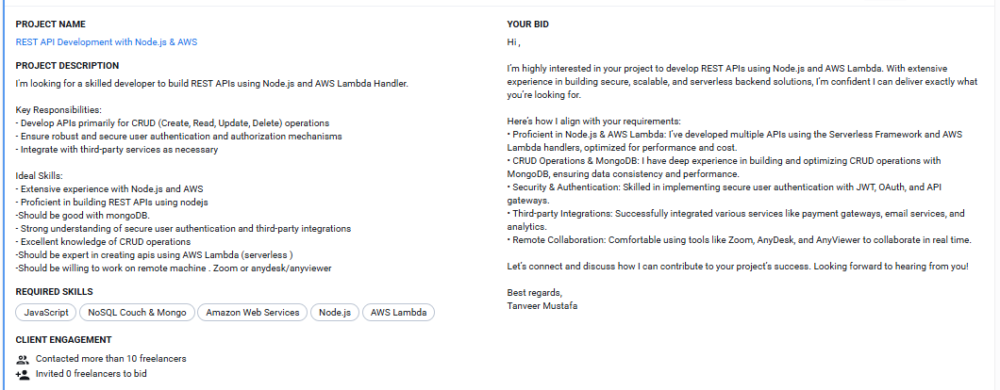
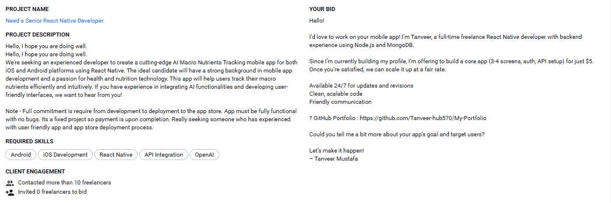
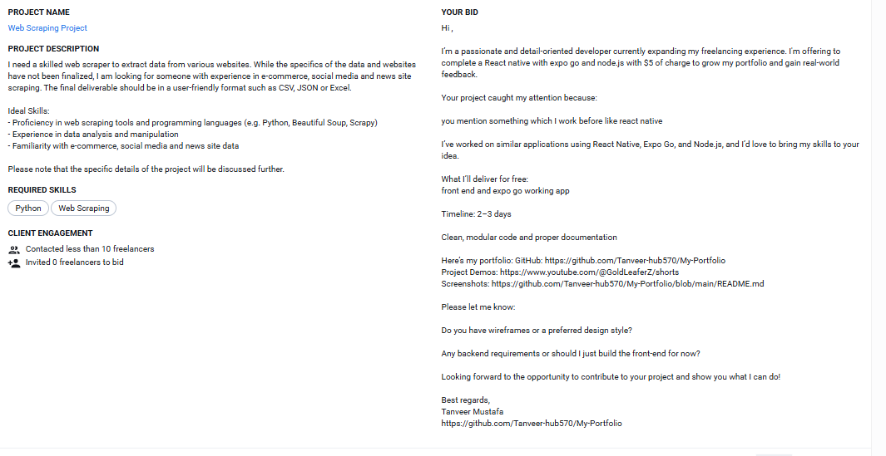
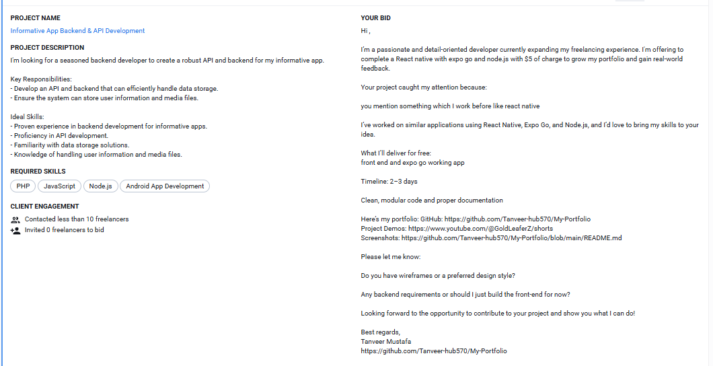
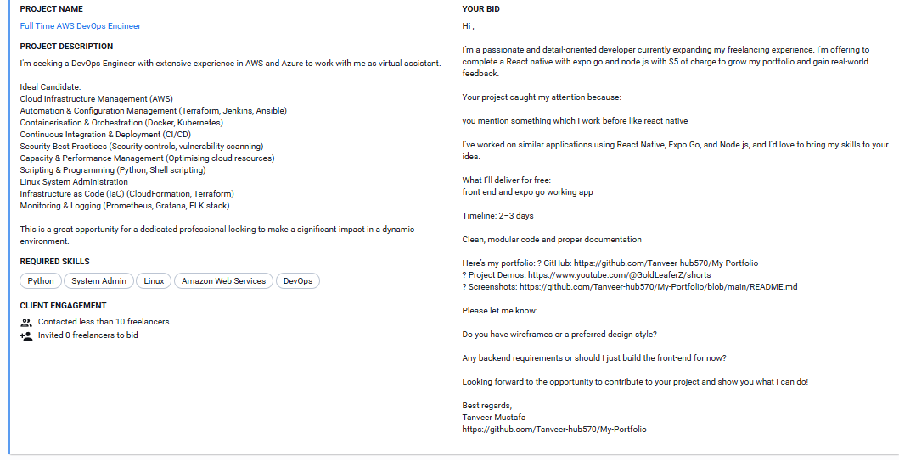
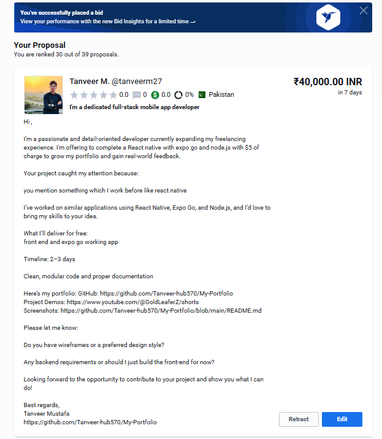
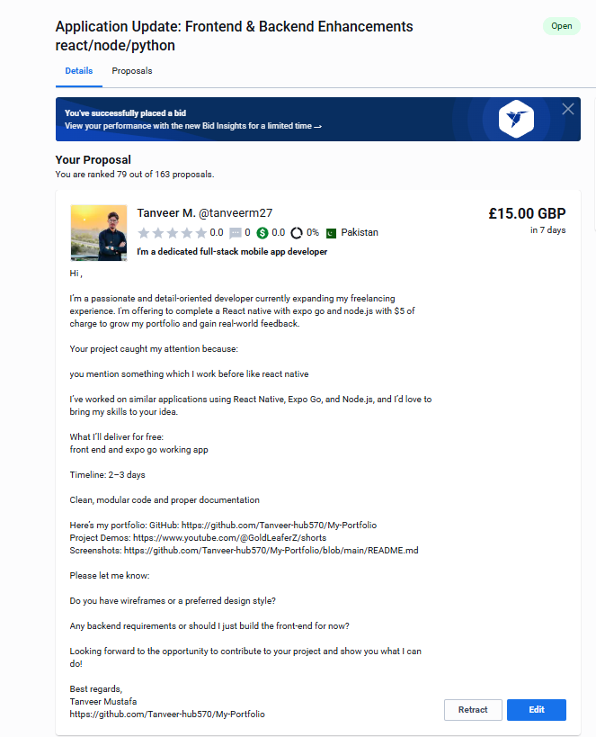
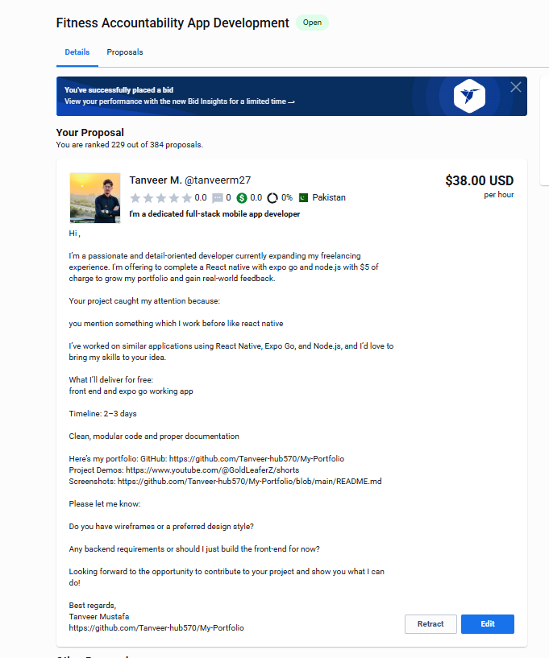

# 👨‍💻 Freelance Project Portfolio – Real Bids, Real Projects

Despite submitting multiple high-quality proposals on **Freelancer**, **Guru**, and other platforms, I haven’t yet received responses. So I’m sharing this complete portfolio to **showcase real work** I’ve done—**professional-grade mobile apps**, full-stack integrations, and clean UI/UX projects.

If you're a **client looking for a skilled, consistent, and proactive developer**, this is what I can bring to the table.

---

## ✨ Why Choose Me?

- ✅ Real, working apps with live API integrations
- 🎨 Pixel-perfect UI/UX using modern tools and frameworks
- 🔒 Secure and scalable backend implementations
- 🔁 Fast turnaround and consistent communication
- 🚀 Always learning, always improving

---

## 📱 Featured Projects

### 🍔 Food Delivery App – React Native + Yelp API

A fully functional food delivery app built using **React Native** and **Expo**, integrating **Yelp API** for live restaurant data. This app mimics real-world platforms like Uber Eats and DoorDash.

**Highlights:**
- Live restaurant data
- Cart, checkout, and order tracking
- Beautiful animations and navigation

---

### 🎬 Disney Movie App Clone – TMDb API

A visually rich movie app fetching data using the **TMDb API**, providing a Disney-themed movie browsing experience.

**Highlights:**
- Movie previews, trailers, ratings, and reviews
- Custom UI animations and transitions
- Genre and keyword-based filtering

---

### 💼 Job Listing Platform – Full Stack (Google Auth + MongoDB)

A modern job portal app that allows employers to post jobs and applicants to apply using **Google OAuth**. Built using React, Node.js, Express, and MongoDB.

**Highlights:**
- Google authentication and user sessions
- Secure admin dashboard
- Dynamic job filtering

---

### 🛒 Ecommerce Mobile App – React Native UI

A clean and intuitive UI for an ecommerce shopping app.

**Highlights:**
- Product listings and category filters
- Shopping cart interface
- Optimized for performance and responsiveness

---

### 🛵 Food Delivery UI – Design to Code

Built from a Figma prototype, this app demonstrates strong design fidelity, animation, and layout structure.

**Highlights:**
- Realistic restaurant and dish displays
- Custom icons and styling
- Modular component architecture

---

## 🖼️ Screenshots (Bids & Projects)

Here are screenshots of the apps I’ve built and the proposals I submitted across platforms like **Freelancer** and **Guru**.

|  |  |  |
|---------------------------|---------------------------|---------------------------|
|  |  |  |
|  |  |  |
|  |  |  |
|  |  |  |
|  |  |  |
|  |  |                           |

---

## 🤝 Let's Work Together

If you're a client or recruiter browsing this, I’d love to work with you! I bring passion, precision, and a collaborative mindset.

- 📧 **Email**: tanveermustafa57@gmail.com  
- 🌐 **Portfolio**: https://github.com/Tanveer-hub570/My-Portfolio  

---

## 📄 License & Attribution

This portfolio is for showcasing freelance and educational projects only. APIs and assets (e.g., from Yelp, TMDb) are used within their terms and guidelines.

> 🔥 Thank you for checking out my work – let's build something amazing together!
