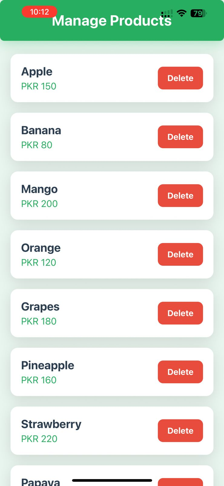
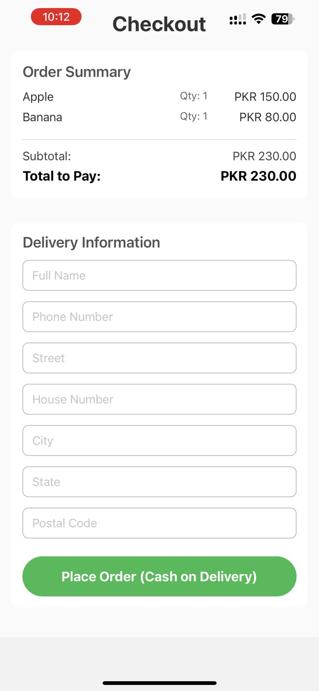
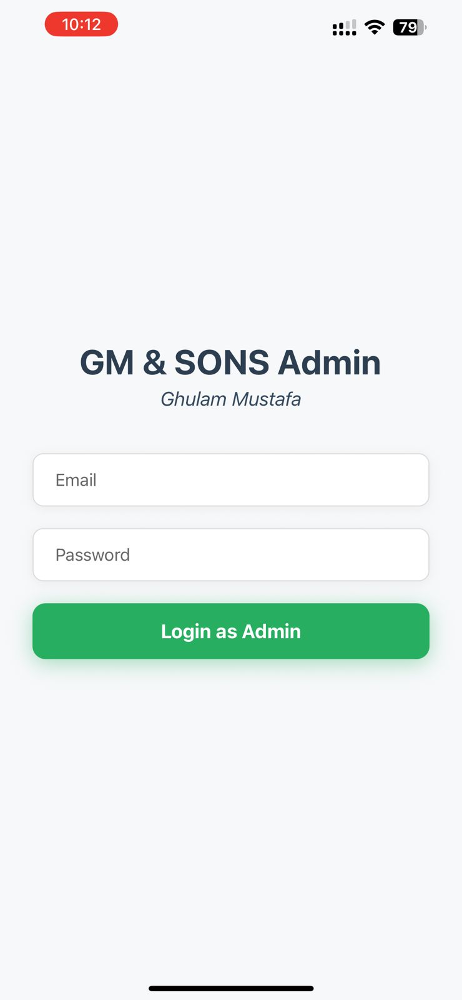
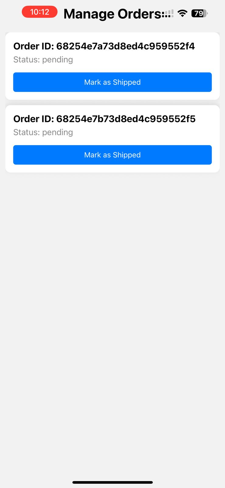

# 📱 GM & SONS Mobile App

Welcome to the official **GM & SONS Mobile App** — a user-friendly, cross-platform mobile application designed to help customers browse and order fresh fruits and vegetables directly from GM & SONS.

## 🚀 Overview

GM & SONS is Pakistan’s leading fresh produce supplier. This mobile app complements the admin web dashboard and enables users to:

- 🛒 Browse Fruits and Vegetables
- 📦 View Product Details by Category
- 🤝 Explore Partner Stores
- 📱 Place Orders with Ease

Optimized for Android and built with React Native + Expo.

---

## 🎥 Demo Video

Watch the full walkthrough of the GM & SONS Mobile App here:

🔗 [Watch on YouTube](https://youtube.com/shorts/CtViVGoRYuw?feature=share)

---

## 📲 Download App

Scan the QR code below to **download and install the APK** on your Android device:


---

## 📱 App QR Demo

Scan this code to **see the app demo** in Expo Go:


> ⚠️ Make sure you have the [Expo Go App](https://expo.dev/client) installed on your device.

---

## 🖼️ Screenshots

### 🏠 Home & Product Categories

| Home | Categories |
|------|------------|
|  |  |

### 🛍️ Product Browsing & Detail View

| Product Added to Cart | Product Detail |
|--------------|----------------|
|  |  |

### 👤 Partners & Orders

| Partners | My Orders |
|----------|-----------|
|  |  |

### 🧾 Cart & Checkout

| Cart | Checkout |
|------|----------|
|  |  |

### 🔐 Authentication Screens

| Login | Signup |
|--------|--------|
|  |  |

---

## 🛠️ Tech Stack

- **Frontend:** React Native + Expo
- **UI:** React Native Paper + Custom Styles
- **Backend API:** Node.js + Express (shared with Web Dashboard)
- **State Management:** Context API / AsyncStorage
- **Database:** MongoDB
- **Authentication:** JWT

---

## 📁 Setup Instructions

```bash
# Clone the repo
git clone https://github.com/your-username/gmsons-mobileapp.git
cd gmsons-mobileapp

# Install dependencies
npm install

# Start the Expo dev server
npm start
```

> 💡 **Run on Android:** Use Expo Go app and scan the QR code from terminal or open in Android Emulator.

---

## 📬 Contact

For business inquiries or support, contact **GM & SONS PRIVATE LIMITED**  
📧 gm7090211@gmail.com  
📍 Pakistan

---

© 2025 GM & SONS. All rights reserved.
