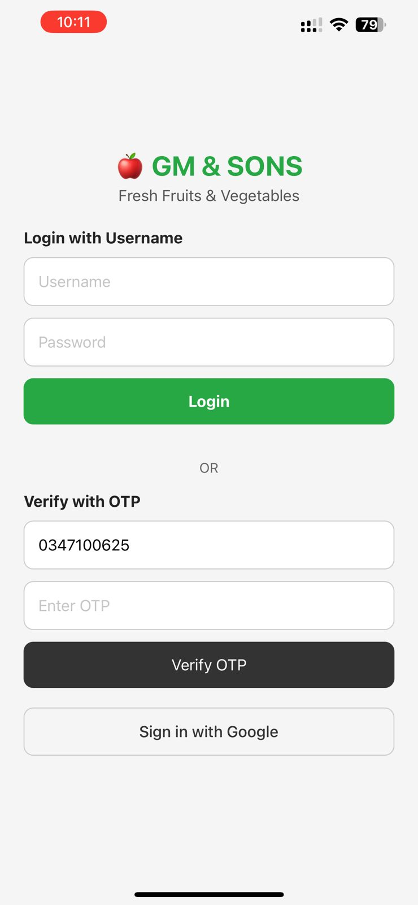
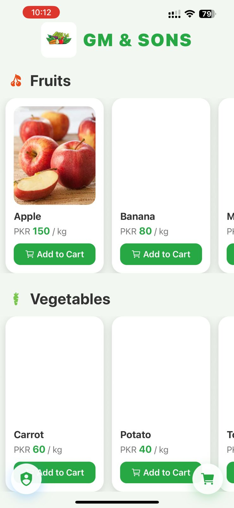
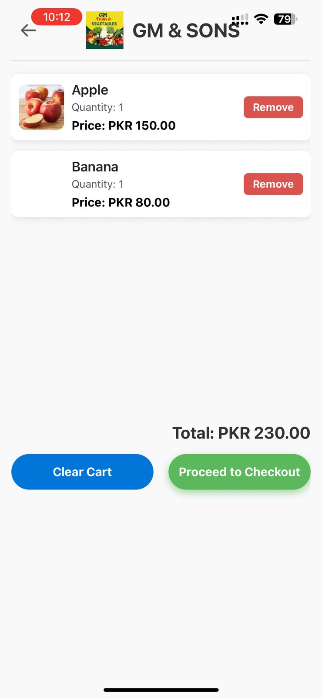

# 📱 GM & SONS Mobile App

Welcome to the official **GM & SONS Mobile App** — a sleek, user-friendly mobile experience designed to bring the power of inventory and partner management to your fingertips.

> _“GM & SONS is Pakistan’s trusted name in fresh fruits & vegetables. Our mobile app ensures our partners and admins can stay productive — anytime, anywhere.”_

---

## 🎬 Demo Video

Get a firsthand look at the mobile app in action:

🔗 [Watch the Demo](https://youtube.com/shorts/CtViVGoRYuw?feature=share)

---

## 🧾 Screenshots

| 🏠 Home Screen | 📋 Product List |
|---------------|-----------------|
|  |  |

| ➕ Add Product | 🧍 Partner Page |
|----------------|----------------|
|  |  |

| 🔒 Login |
|----------|
|  |

---

## 🚀 How to Run the App on Your Phone

You can instantly preview the mobile app on your **iOS** or **Android** device using the **Expo Go** app.

### 📥 Step-by-Step Installation

1. **Install Expo Go** from the App Store (iOS) or Google Play Store (Android).
2. **Open the Expo Go app**.
3. **Scan the QR code below** using your camera or within Expo Go.

### 📲 Scan to Launch the App


> The app will launch directly on your device. No build or installation needed!

---

## ⚙️ Tech Stack

- **Mobile Framework:** React Native + Expo
- **UI Styling:** Tailwind CSS via NativeWind
- **Navigation:** React Navigation
- **Backend API:** Node.js + Express
- **Database:** MongoDB
- **Authentication:** JWT-based login

---

## 🔐 Admin Credentials

To log in to the app:

**Email:** gmson@gmail.com  
**Password:** tanveer123

---

## 🧑‍💻 Developer Setup (Optional)

Want to run the app locally?

```bash
# Clone the repository
git clone https://github.com/your-username/gmsons-mobileapp.git
cd gmsons-mobileapp

# Install dependencies
npm install

# Start development server
npx expo start
```

Then scan the QR code that appears in your terminal using Expo Go.

---

## 📨 Contact

For questions, support, or business inquiries:

📧 **gm7090211@gmail.com**  
📍 Pakistan

---

© 2025 GM & SONS. All rights reserved.
