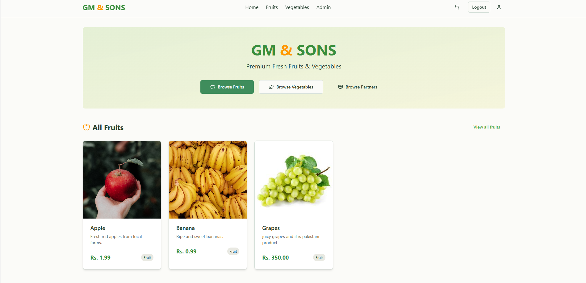
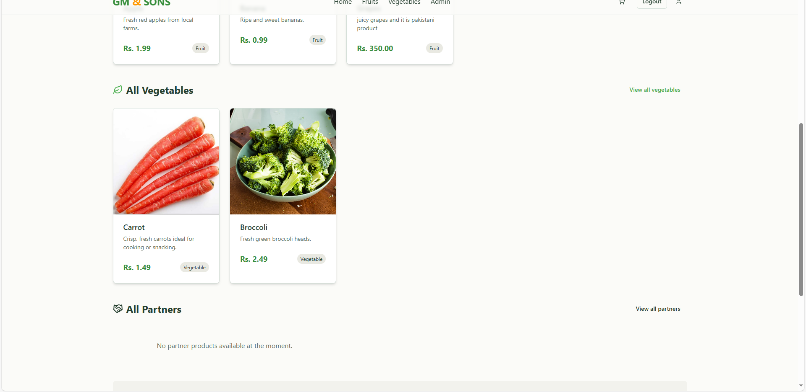
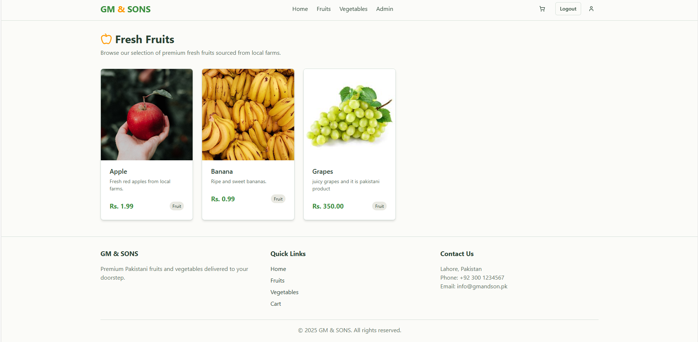
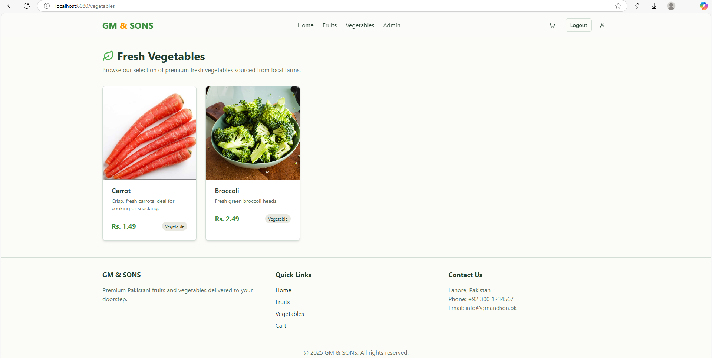
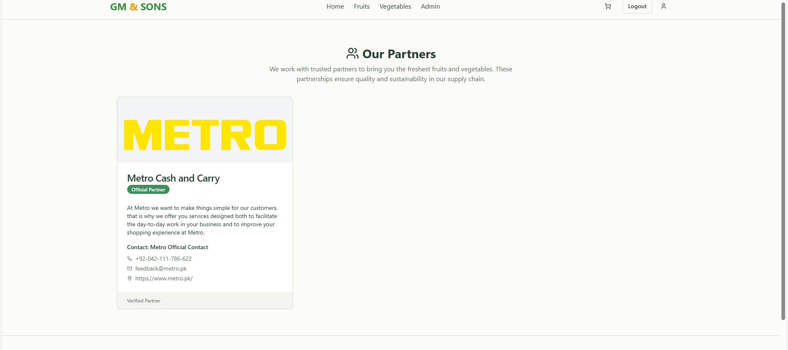
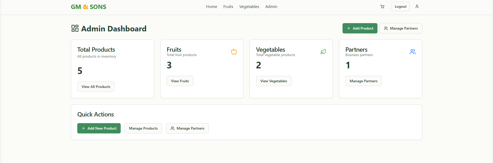
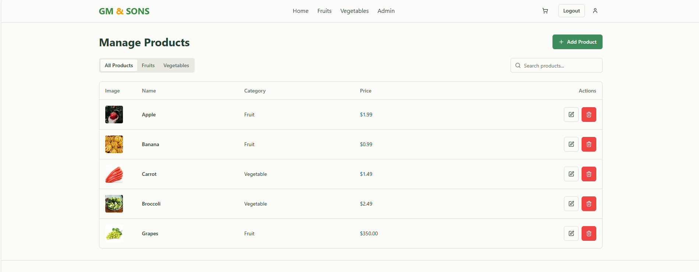

# GM & SONS Web App 🌐

Welcome to the official **GM & SONS Web App** — a modern, responsive dashboard for managing products, partners, and users in one place.

## 🚀 Overview

GM & SONS is Pakistan’s leading fresh fruits and vegetables supplier. This web app was built to streamline the backend operations, allowing admins to manage:

- ✅ Fruits and Vegetables Inventory
- ✅ Product Categories (e.g., Fruits, Vegatables)
- ✅ Dynamic Partner Catalog
- ✅ User and Order Management

Built with performance and usability in mind, this dashboard complements the GM & SONS mobile application.

---

## 🎥 Demo Video

Watch the full walkthrough of the GM & SONS Web App here:

🔗 [Watch on YouTube](https://youtube.com/shorts/CtViVGoRYuw?feature=share)

---

## 🖼️ Screenshots

Here are some key UI views of the GM & SONS Web App:

### 🧾 Dashboard and Product Management

| Dashboard | Product List |
|----------|--------------|
|  |  |

### 📦 Add & Edit Products

| Add Product | Edit Product |
|-------------|--------------|
|  |  |

### 👥 Partner and User Management

| Partners | Users |
|----------|-------|
|  |  |

### 🔐 Admin Login Screen



---

## 🛠️ Tech Stack

- **Frontend:** React + Tailwind CSS + Shadcn/UI
- **Backend:** Node.js + Express
- **Database:** MongoDB
- **Authentication:** JWT & Hardcoded Admin Login
- **Hosting:** Render / Vercel

---

## 👨‍💼 Admin Credentials

Use these to log in to the web dashboard:

```
Email: gmson@gmail.com  
Password: tanveer123
```

---

## 📁 Setup Instructions

```bash
# Clone the repo
git clone https://github.com/your-username/gmsons-webapp.git
cd gmsons-webapp

# Install dependencies
npm install

# Start the dev server
npm run dev
```

---

## 📬 Contact

For business inquiries or support, contact **GM & SONS PRIVATE LIMITED**  
📧 gm7090211@gmail.com  
📍 Pakistan

---

© 2025 GM & SONS. All rights reserved.
